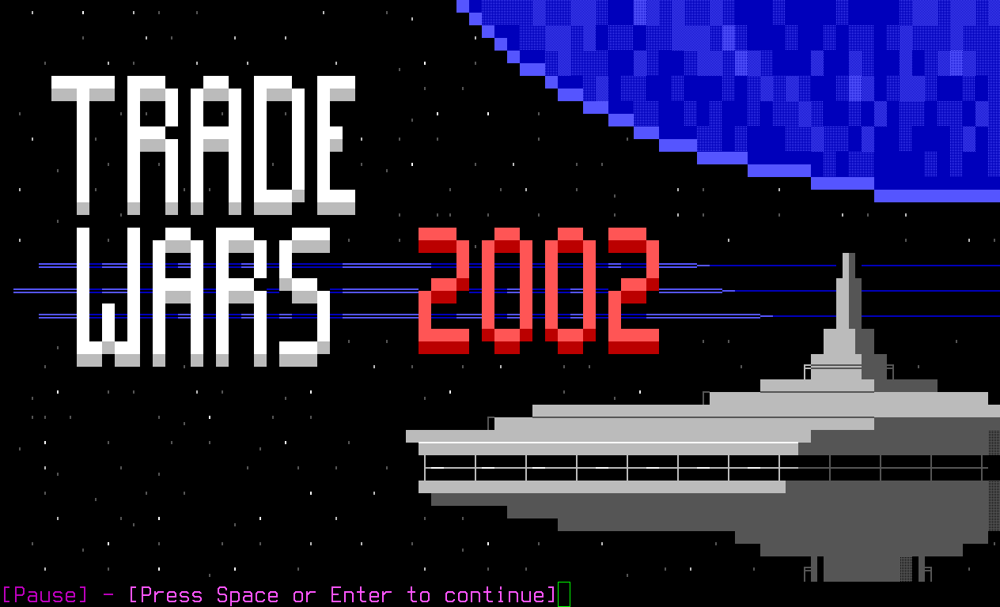

# trade: ssh -> telnet proxy with bonus sugar

trade is intended to connect to Tradewars 2002 servers. It performs a number of
features which make tradewars playable on a modern computer:

<center></center>
<small>(inside alacritty with standard ssh)</small>

* Multiple connections, same proxy -- all connections route to the same telnet
  session.
* translates DOS Code Page 437 to UTF-8, including line drawing characters.
  Works great with putty default settings over SSH, or most modern terminals
  with openssh.
* operates over SSH (telnet is still used to connect to tradewars)
* Menu for controlling your sessions (no escape key yet, though!)
* *COMING SOON* expect-like scripting capabilities with mruby
* *COMING SOON* outbound ssh support for controlling things that are not tradewars!

## Usage

```bash
$ go get github.com/erikh/trade
$ trade gen # generates a host key in ~/.config/trade/host_key
$ trade &
$ ssh -p 2002 localhost
```

After connecting with SSH, you can press enter or `?` to get a menu. Press `c` to connect
to a server (try `home.hollensbe.org:2002`!) or `s` to shutdown the server.

## Author

Erik Hollensbe <github@hollensbe.org>
